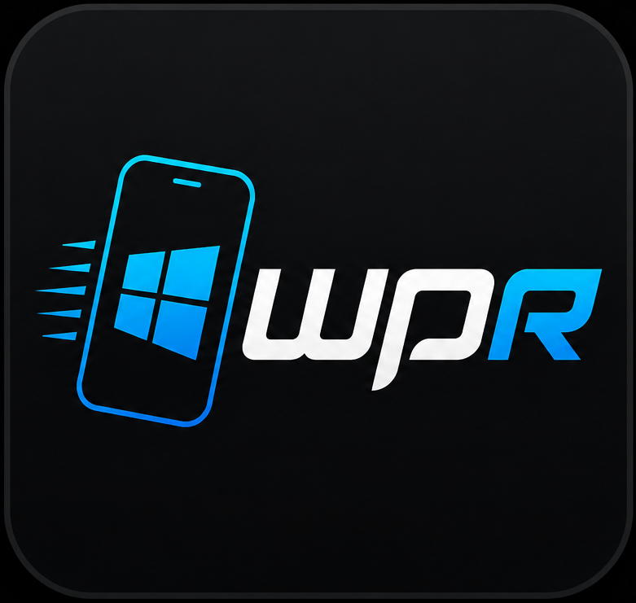
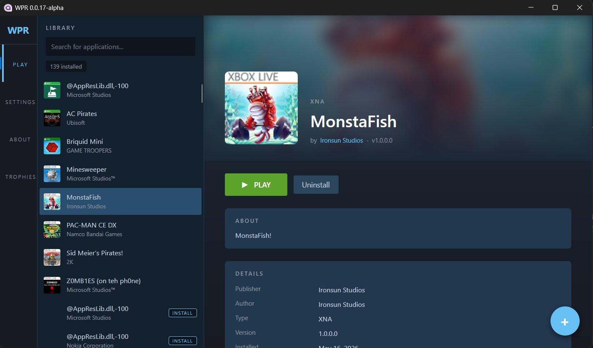
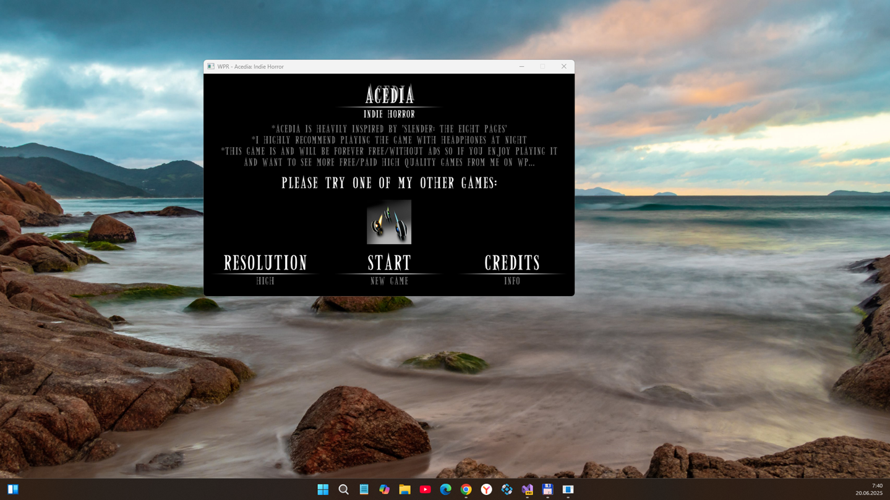
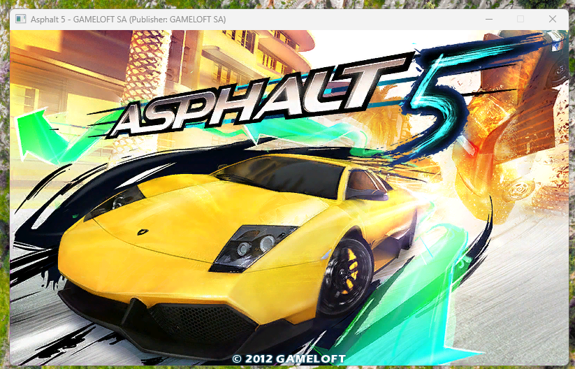
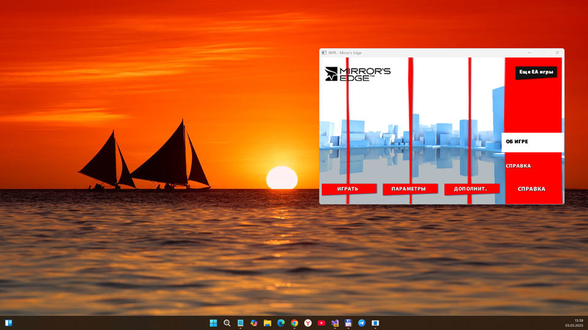

# WPR 0.0.8.1-alpha :: dev branch


WPR is a WP7-8 XNA app runner. This is only my fork of [WPR](https://github.com/8212369/WPR), not the original. 

## Screenshots





## Status
- I started experimenting with .NET 8 & Avalonia 11. Mirror's Edge : fixed (I hope!) 
- All Android-related parts of WPR code are deleted. Android code available only in/at obsolete *master* branch.
- Thinking of/about switch from Avalonia to Uno / Xamarin Forms / MAUI...

## Tech. details
- Newest VS 2022 Preview used to "assemble" (build) this "dev branch"
- I think that WPR "dev edition" incompatible with Win10 because of .NET 8... So, fresh Windows 11 OS needed to run WPR-0.0.7 (however, some reduced Windows 11 Tiny is goode choice even for 15-year-old retro-notebooks... Sony Vaio, etc.)))

## Bugs and mini-FAQs
- Some games will requre touch screen. In WPR 0.0.7, touch taps emulation (via mouse) is not full (or not present, idk). Example: Skulls of the Shogun.
- Some games have not full screen (or only part of Windowed zone). Example: Zuma Revenge!
- Some games can't install because of no WMAppManifest.xml inside xap file. Ho to fix: rename .xap to .zip, and fix WMAppManifest.xml data. For example, I used WMAppManifest.xml (from EarthWormJim.xap) to patch attributes in ZumaRevenge.xap:
```
<?xml version="1.0" encoding="utf-16"?>
<Deployment xmlns:xsi="http://www.w3.org/2001/XMLSchema-instance" xmlns:xsd="http://www.w3.org/2001/XMLSchema" AppPlatformVersion="7.0" xmlns="http://schemas.microsoft.com/windowsphone/2009/deployment">
  <App Author="Electronic Arts" Description="" Genre="apps.games" ProductID="{128459e9-47a9-df11-a844-00237de2db9e}" Publisher="ElectronicArts" RuntimeType="XNA" Title="Zuna Revenge!" Version="1.0.1.0" xmlns="">
    <IconPath IsRelative="true" IsResource="false">PhoneGameThumb.png</IconPath>
    <Capabilities>
      <Capability Name="ID_CAP_NETWORKING" />
      <Capability Name="ID_CAP_SENSORS" />
      <Capability Name="ID_CAP_MEDIALIB" />
      <Capability Name="ID_CAP_GAMERSERVICES" />
      <Capability Name="ID_CAP_IDENTITY_DEVICE" />
    </Capabilities>
    <Tasks>
      <DefaultTask Name="_default" />
    </Tasks>
    <Tokens>
      <PrimaryToken TokenID="ZumasRevenge.GameMain" TaskName="_default">
        <TemplateType5>
          <BackgroundImageURI IsRelative="true" IsResource="false">Background.png</BackgroundImageURI>
          <Count>0</Count>
          <Title>Zuma Revenge!</Title>
        </TemplateType5>
      </PrimaryToken>
    </Tokens>
  </App>
</Deployment>
```

## ToDo
- Actualize Wiki section
- Transtale Readme to RU and CN
- Fix resolution scaling...
- Port this "app creature" into Xamarin Forms or Uno "multi-platform engine" :)

## Credits
- Tyler Jaacks (https://github.com/TylerJaacks) - for net5/6 -> net8 upgrade !
- Hector47 (https://github.com/Hector47) for try to add some online services and more :)

## Another cool forks I noticed over 3 years 
-  https://github.com/TylerJaacks/WPR (branches *net8_upgrade* & *dotnet_upgrade* are very interesting & useful!)
-  https://github.com/Hector47/WPR (master branch: some GameServices ideas)

## :: ::
AS IS. No support. Developers / Geeks only. "DIY mode"

## ::
[m][e] 2025

