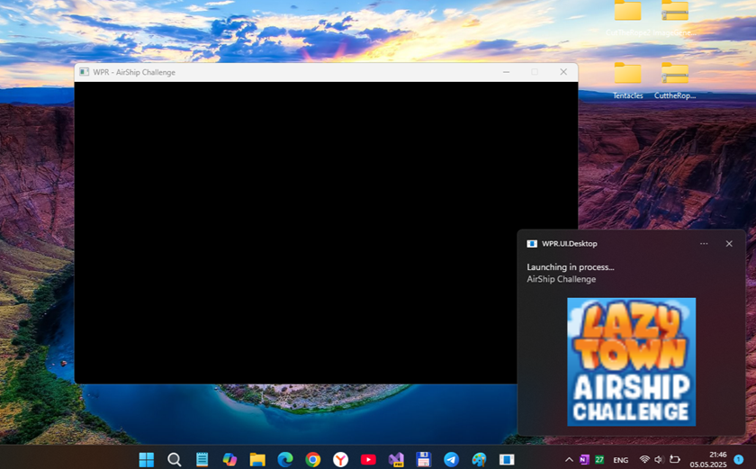
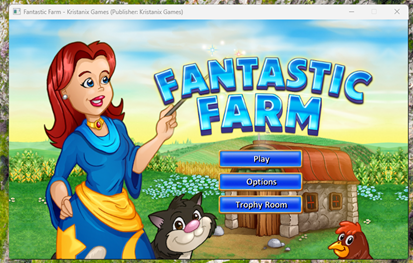
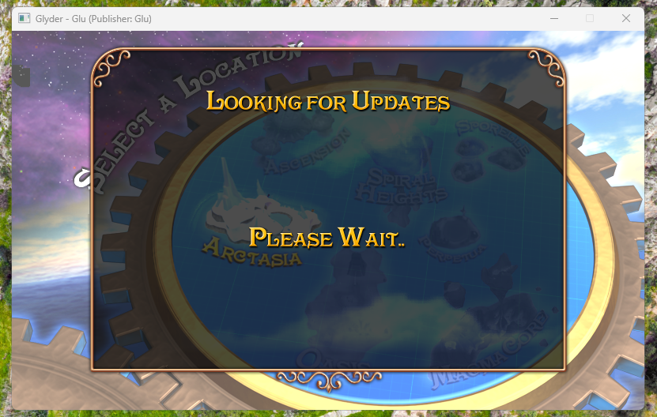
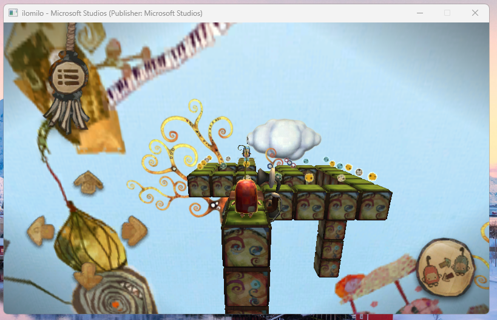
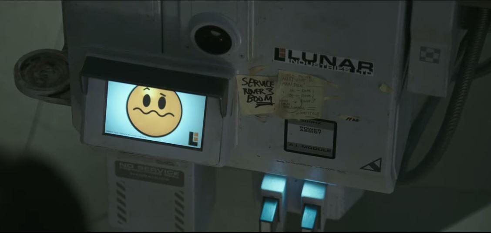

# WPR 0.0.17-alpha :: dev branch

WPR is a WP7-8 XNA app runner. This is only my fork of [WPR](https://github.com/8212369/WPR), not the original. 

NOTE: previous *dev* branch copied to "experimental" one. In my new "dev" branch I cancelled my "iOS / XBox" dream (not enough skills, heh!) and returned to Avalonia……… 

CAUTION: _dev_ branch may not build / run normally. This is work-in-progress!

## Screenshots

## What's new in dev?
- Developed a merger strategy based on compatibility with .NET 8 and Avalonia 11.3.9
- Merged (almost?) all functions from version 0.0.12
- Added explicit logging of Avalonia initialization for launching and displaying in the main window
- Added a small health check window to confirm the creation of a UI thread and window
- Fixed all critical errors that interfere with the build.:
- Fixed bugs related to AudioCompabilityConverter
- Fixed errors related to MessageBox and namespaces
- Fixed bugs related to ViewLocator and Avalonia
- Performed a test build for Android target using MSBuild, which was successful without errors (warnings only)

## Status
- Build ok... I started experimenting with .NET 8 & Avalonia _11.3.9_. I started to repair Android part of solution & Desktop (Windows) part of solution too. So, *avalonia* branch consists of 2 targets: Windows & Android at now :)
- With help of Trial mode of WindSurf (and ChatGPT 4 AI) I partially repaired Android-related parts of WPR code... But this is still work-in-progress: 100500 new errors (because of Avalonia 11 incompatibility with Avalonia 9 / 10), and many game "patches" lost!
- Experimental "UI improvements applied ("Two small Run and Uninstall" icons added to main/larg icon in app/game list) lost. No "Run & App at popup/context menu".
- All AI-generated things not tested yet 
- For Android target, I changed Min. Supported Android Api version from 21 to 26 in project (.csproj) files. 
- Exploring some "game run failed" bugs (Penguins Can't Fly, Acedia Horror, etc.) 

## Tech. details
- Newest VS 2022 or above must be used to "assemble" (build) this _avalonia_ branch
- WPR 0.0.17 "avalonia edition" may be incompatible with Windows 10 because of .NET 8... So, fresh Windows 11 OS recommender to run WPR.UI.Desktop (however, some reduced Windows 11 Tiny is good choice even for some very retro-notebooks!).

## TODO
- Solve Desktop (Windows) game start bugs (after .NET 8 / Avalonia 11.3 upgrade)
- Solve "White screen instead of App UI" bug for Android target 
- Repair lost game patches (use "avalonia-win" branch) 
- Test Desktop (Windows) target
- Test Android target
- Actualize Wiki section
- Transtale Readme to RU and CN
- Fix Zuma "game screen" scaling...
- Try to port this "app creature" (in)to modern "multi-platform engine" such as MAUI (far future)

## Test Plan Steps
-  **run build**
-  **inspect build errors**
-  **open files reported in errors**
-  **apply minimal code fixes to each file**
-  **run build to verify fixes**
-  **repeat until build succeeds or errors blocked**

## Credits
- Tyler Jaacks (https://github.com/TylerJaacks) - for net5/6 -> net8 upgrade !
- Hector47 (https://github.com/Hector47) for try to add some online services and more :)

## Another cool forks I noticed over 3 years 
-  https://github.com/TylerJaacks/WPR (branches *net8_upgrade* & *dotnet_upgrade* are very interesting & useful!)
-  https://github.com/Hector47/WPR (master branch: some GameServices ideas)

## :: ::
AS IS. No support. Developers / Geeks only. "DIY mode"

## ::
[m][e] 2026

