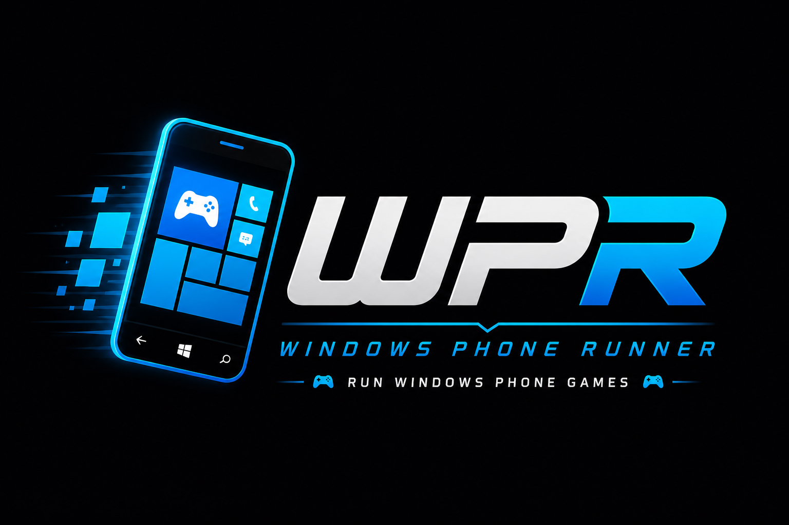

# WPR 0.0.18-alpha


WPR is a Windows Phone 7/8 game runner that re-hosts XNA (and, increasingly,
Silverlight) titles on modern Windows desktop and Android. This is a fork of
the original [WPR](https://github.com/8212369/WPR) — heavily modified to
target **.NET 8 + Avalonia 11.3.9** with a runtime shim layer that lets
unmodified game `.xap` packages run against modern .NET.

> **Status:** work-in-progress. The `main` branch is not guaranteed to build
> or run cleanly at any given checkpoint. Active development happens on
> per-feature branches (currently `fix-zuma-revenge`).

## Screenshots


## What's new in this fork

Since branching from upstream WPR:

- **.NET 8 / Avalonia 11.3.9 port.** Replaced the legacy Avalonia 0.9/0.10
  UI stack; rebuilt the desktop and Android entry points
  (`WPR.UI.Desktop`, `WPR.UI.Android`).
- **Silverlight runtime (initial).** Added `WPR.SilverlightCompability`,
  a from-scratch reimplementation of Silverlight 4 / Windows Phone XAML
  controls on top of Avalonia. Layout, gestures and the Panorama / Pivot
  parallax state machine are written in-tree (no Silverlight parser
  dependency). Currently boots a small set of Silverlight XAPs — see the
  compatibility table below. Launched via `SilverlightLauncher.LaunchAsync`.
- **Persistent achievements.** Per-game achievement progress is now seeded
  at install time (`XnaAchievementSeeder` scrapes TrueAchievements once and
  populates a SQLite DB) and stored across runs.
- **Refactored shim layout.** `WPR.SilverlightCompability`'s source tree now
  mirrors the upstream Silverlight namespace hierarchy (one C# file per
  type, file path matches the real namespace) — see
  [CLAUDE.md](CLAUDE.md) for the convention.
- **Per-game debug logs.** `ApplicationLaunch` mirrors `Trace`/`Debug`
  output to `%LocalAppData%\WPR\Apps\<ProductId>\wpr_game_debug.log` so
  silent-crash games leave a diagnostic file.
- **Keyboard accelerometer.** Bind keys to simulate phone tilt for games
  that use `Microsoft.Devices.Sensors.Accelerometer`. The Controls page
  (sidebar) lets you set the four tilt directions, adjust sensitivity,
  toggle the in-game tilt overlay, and live-preview the synthesized
  reading. Orientation-aware: in landscape games the screen-relative
  intent (W = "tilt up the screen") is rotated into the device-portrait
  frame the WP7 sensor contract expects.
- **Startup health-check & explicit Avalonia init logging** on both desktop
  and Android targets.
- **FontAwesome icon provider** registered in the AppBuilder; main app
  list now populates on launch (was waiting on search input).
- **Android target rebuilt** against Avalonia 11; min-SDK raised; SDL2 +
  FFmpeg bindings included via Java bindings projects.


## Architecture

WPR runs a Windows Phone game's original assemblies, IL-rewritten at
install time to redirect WP/Silverlight/XNA API calls to in-tree shims.

```
.xap / XNA folder
      │
      ▼ LibraryScanner          (discovers packages)
      ▼ ApplicationInstaller    (unpacks to %LocalAppData%\WPR\Apps\<ProductId>)
      ▼ ApplicationPatcher      (Cecil-rewrites every .dll; leaves .dll.original)
      ▼ XnaAchievementSeeder    (populates SQLite achievements DB)
      │
      ▼ (user clicks "Run")
      ▼ XnaLauncher  →  ApplicationLaunch.Start  (XNA games via FNA)
      ▼ SilverlightLauncher.LaunchAsync          (Silverlight XAPs)
```

Project layout (`Src/`):

| Project | Role |
| --- | --- |
| `Core/WPR` | Install/launch/patch pipeline, models, EF Core DB |
| `Core/WPR.Common` | Logging, paths, configuration |
| `Core/WPR.SilverlightCompability` | Silverlight 4 / WP XAML re-impl on Avalonia |
| `Core/WPR.WindowsCompability` | `System.Windows.*` shims (Application, BitmapImage, IsolatedStorage, …) |
| `Core/WPR.StandardCompability` | `System.ServiceModel` / WCF-lite shims |
| `Core/WPR.XnaCompabilityPatch` | XNA-side shims layered on top of FNA |
| `Core/Microsoft.Phone` | `Microsoft.Phone.*` (Shell, Tasks, Marketplace, Scheduler, …) |
| `Core/Microsoft.Xna.Framework.GamerServices` | Gamer profile, achievements, leaderboards |
| `Core/Microsoft.Device.Sensors` | Accelerometer / Compass |
| `Core/System.Device` | `System.Device.Location` |
| `UI/WPR.UI` | Shared Avalonia UI (views, view-models, launchers) |
| `UI/WPR.UI.Desktop` | Windows entry point (net8.0-windows10.0.17763.0) |
| `UI/WPR.UI.Android` | Android entry point |
| `ThirdParty/fna` | FNA (XNA reimplementation) |
| `ThirdParty/Icons.Avalonia` | Vendored Projektanker icons, patched for Avalonia 11.3.9 |

See [CLAUDE.md](CLAUDE.md) for the in-depth build/install/patch workflow,
including the rule that **patcher table changes require reinstalling
affected games** (the IL rewrite happens once at install time).


## Build & run

Recommended:

1. Open `Src/WPR.sln` in **Rider** (or VS 2022 17.8+).
2. Build → run `WPR.UI.Desktop`.

Target frameworks:

- Desktop: `net8.0-windows10.0.17763.0`
- Android: `net8.0-android` (set up via the system .NET SDK + Android
  workload — see [CLAUDE.md](CLAUDE.md) for the SDK version pitfalls on
  this dev box)

### CLI build (for quick edit-verify)

The full-solution `dotnet build` hits `NU1202` on `Avalonia.Android` if the
workload version doesn't line up. To verify a small edit on a leaf project:

```pwsh
dotnet build <project>.csproj -c Debug `
    -f net8.0-windows10.0.17763.0 `
    -maxcpucount:1 -nodeReuse:false --nologo
```

The `-maxcpucount:1` flag avoids an MSBuild CS0006 race; the explicit TFM
skips the Android leg.


## Game compatibility

Moved to the wiki — see
[Compatibility List](https://github.com/Bubbleshum/WPR/wiki/Compatibility-List).


## Runtime types supported

The installer recognises three `.xap` flavours
([`ApplicationType.cs`](Src/Core/WPR/Models/ApplicationType.cs)):

| Type | Status | Notes |
| --- | --- | --- |
| `XNA` | Working | Main path; runs on FNA via the `WPR.XnaCompability` shim layer. |
| `Silverlight` | Experimental | Boots a small set of XAPs through the in-tree `WPR.SilverlightCompability` Avalonia re-impl. |
| `ModernNative` | Not supported | C++/CX + WinRT apps ship as native PE binaries — out of scope. |


## Known limitations & TODO

- Desktop game-launch regressions following the .NET 8 / Avalonia 11.3 upgrade.
- Android target sometimes shows a white screen instead of the app UI.
- Several patcher entries from legacy WPR are still missing — game-specific
  errors above (`IsolatedStorageSettings2.Contains`,
  `GamerProfile.GetGamerPicture`, etc.) are usually missing shims, not bugs
  in the runner itself.
- Silverlight runtime: only a handful of controls + the Panorama/Pivot machine
  have been implemented; `LongListSelector`, `WrapPanel`, `PhoneTextBox`,
  `PerformanceProgressBar`, `GestureService` / `GestureListener` and several
  default styles (`ButtonStyleLight`, `DarkThemePanoramaStyle`,
  `PhoneApplicationPageStyle`) are still TODO.
- README + Wiki translation (RU / CN).
- Long-term: explore a port to MAUI for unified multi-platform.


## Reinstall vs. rebuild

A common gotcha — patcher changes do **not** affect already-installed games:

- **Shim implementation change** (any `.cs` under `WPR.*Compability`,
  `Microsoft.*`, `System.*`): rebuild only. Installed games pick up the new
  behaviour on next launch.
- **Patcher table change** (`ApplicationPatcher.cs` — new entries in
  `Patches` / `MemberPatches`): rebuild **and reinstall** the affected
  games. The IL was rewritten at install time; new redirects don't apply
  retroactively.


## Tech notes

- Newest Rider / VS 2022 (17.8+) recommended.
- Targets `net8.0-windows10.0.17763.0` — Windows 11 recommended; Windows 10
  may need the 17763 (1809) baseline or newer.
- Desktop runtime pulls in `FAudio.dll` / `FNA3D.dll` / `SDL2.dll` /
  `FNWP72.dll` / `ffmpeg.exe` (shipped next to the executable).
- Per-game install data lives under `%LocalAppData%\WPR\Apps\<ProductId>`,
  with a `<game>.dll.original` sibling kept for re-patching.

## Update History

Moved to the wiki — see
[Update History](https://github.com/Bubbleshum/WPR/wiki/Update-History).


## Credits

- [mediaexplorer74/WPR](https://github.com/mediaexplorer74/WPR) — the fork this
  one is based on; foundational Avalonia port work, Android target groundwork,
  and the long-running RnD that made everything downstream possible
- [Tyler Jaacks](https://github.com/TylerJaacks) — net5/6 → net8 upgrade
- [Hector47](https://github.com/Hector47) — online services groundwork

### Related forks worth looking at

- [TylerJaacks/WPR](https://github.com/TylerJaacks/WPR) — branches
  `net8_upgrade` and `dotnet_upgrade` carry useful work
- [Hector47/WPR](https://github.com/Hector47/WPR) — `master` has GameServices ideas
- [yangzhongke/Windows-Phone-Emulator](https://github.com/yangzhongke/Windows-Phone-Emulator) —
  Silverlight 4 prior art for WP control reimplementations (defers to the
  Silverlight XAML parser, so not transplantable here, but the C# for
  Panorama/Pivot/Transitions is a useful reference)


## ::

AS IS. No support. Developers / geeks only — DIY mode.
